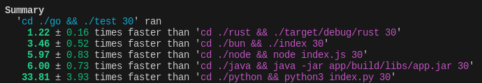

# Speed comparator

I have implemented fibonacci algorithm in multiple languages

```ts
function fibonacci(n: number): number {
if (n <= 1) {
    return n
} else {
    return fibonacci(n - 1) + fibonacci(n - 2)
}
```

And make a script based on `hyperfine` to compare speed of those languages

```bash
bash ./compare.sh
```



## Follow me

- [Youtube](https://www.youtube.com/channel/UC5MAQWU2s2VESTXaUo-ysgg)
- [Github](https://www.github.com/danny270793/)
- [LinkedIn](https://www.linkedin.com/in/danny270793)

## LICENSE

Licensed under the [MIT](license.md) License

## Version

Last update 08/12/2023
